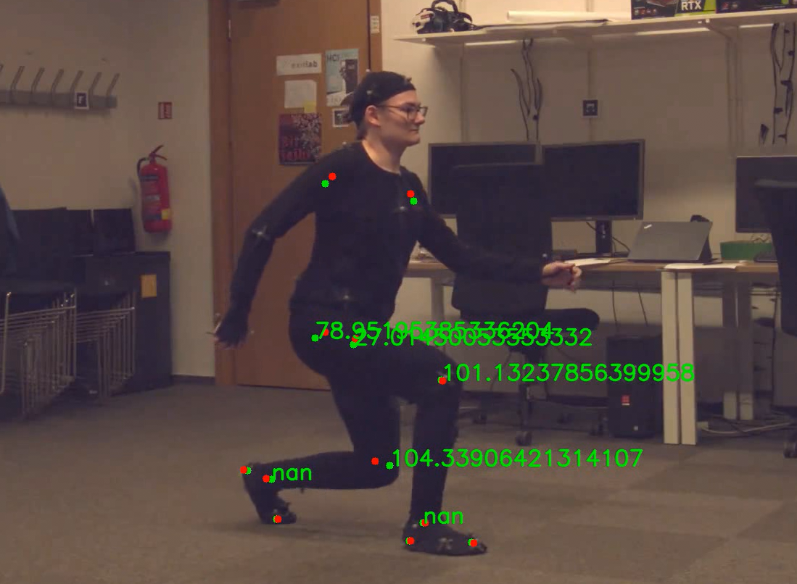
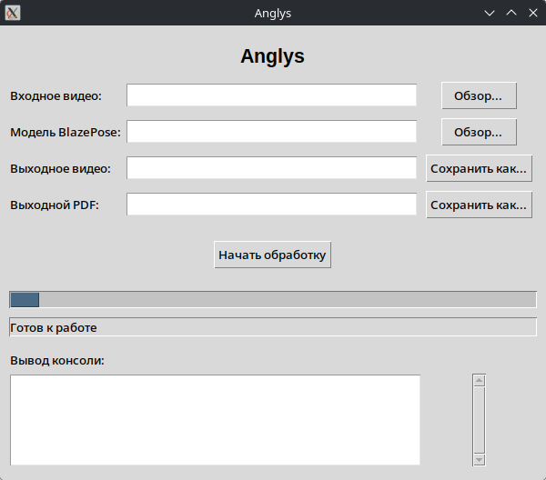

# Anglys - система оценки положения и биомеханики нижней конечности на основе безмаркерного анализа позы

<div align="center">

</div>

Проект создан с целью медицинской реабилитации пациентов с нарушением двигательной функции нижних конечностей. Он использует современные разработки в сфере машинного зрения и машинного обучения, при этом стремиться к быстрой работе даже на старых устройствах.

Данный проект ориентирован на работу с технологиями MediaPipe от Google, но архитектура позволяет интегрировать любую другую нейронную сеть для безмаркерного анализа позы. 

## Требования к оборудованию

Программа была протестирована на оборудовании со следующими характеристиками:
- CPU: Intel Core i5-12400F
- RAM: 32 GB
- Видеокарта с поддержкой CUDA отстутсвует.

При в этом случае видео, содержащее ~3600 обрабатывается 

## Установка

### Консольное приложение
Программа является консольным приложением, требующим Python 3.14+. Установка зависимостей производится с помощью
```
pip install -r requirement.txt
```

### GUI приложение
Также у приложения есть GUI версия, которую можно собрать с помощью pyinstaller. Однако помимо библиотек из requirement.txt потребуются следующие действия:

```
pip install pyinstaller
cd anglys
pyinstaller Anglys.spec
```
В Releases существует готовый бинарный файл для Linux.

## Использование

Данный текст помощи предоставлен для консольного приложения. В GUI флаги выведены в виде полей.
```
Usage: python anglys.py [options] -i <input> -o <video_output> -p <pdf_output> -m <model_path>

Options:
    -i   Input video file
    -o   Output video file
    -p   Output PDF file of graphs
    -m   BlazePose-based model path
    -h   Write help text
```

Данный репозиторий не предоставляет самой модели, но ещё можно взять [этой странице](https://ai.google.dev/edge/mediapipe/solutions/vision/pose_landmarker) от Google.